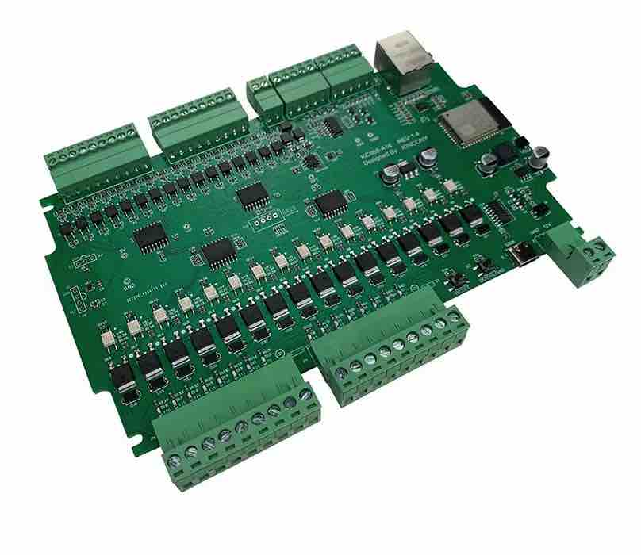
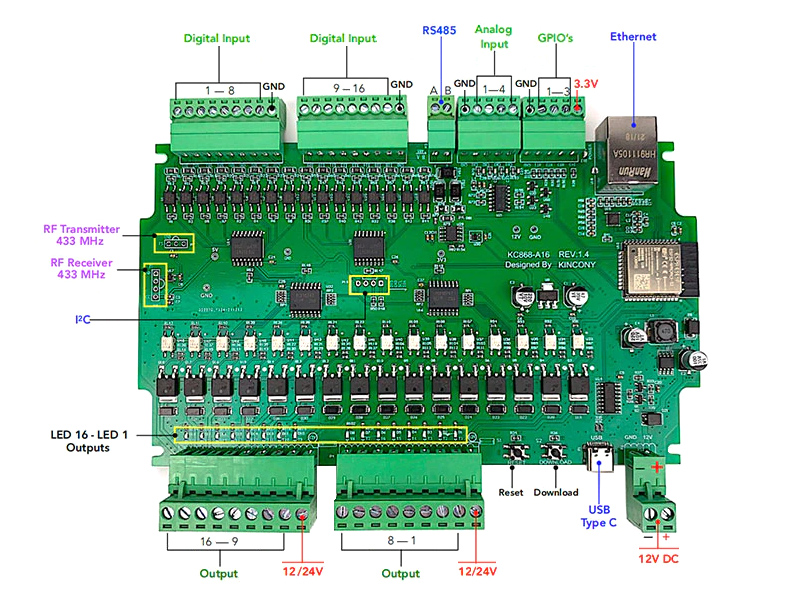
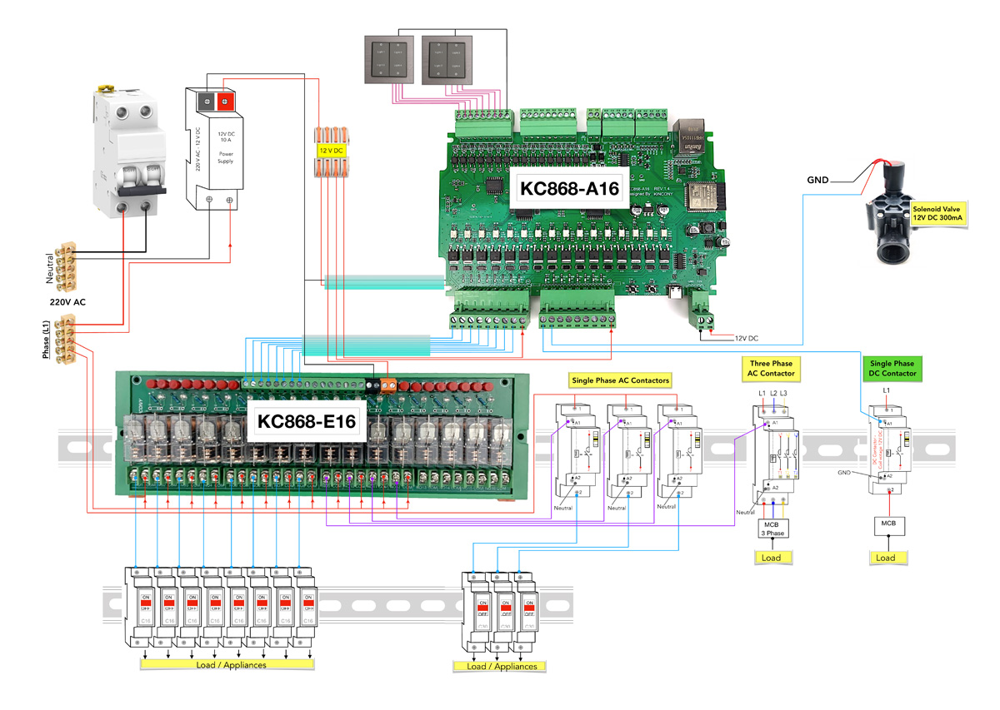

# Tasmota firmware with KC868-A16

if you want to enable **Ethernet for KC868-A16**, just click **"Configure Other"** -- paste **"Template"** as follows:

``` 
{"NAME":"KC868-A16","GPIO":[32,0,1120,0,640,608,0,0,0,1,1,1152,0,0,5600,0,0,0,0,5568,0,0,0,0,0,0,0,0,1,1,0,0,1,0,0,1],"FLAG":0,"BASE":1,"CMND":"EthClockMode 3 | EthAddress 0 | EthType 0 | I2CDriver2 1"}
```

check **"Activate"**  , then press **"Save"**. after restart, ethernet cable can be used.





### KinCony 16 Channel Relay Board (KC868-A16) TASMOTA Template

https://templates.blakadder.com/kincony_KC868-A16.html

### Tasmota firmware para KC868-A16

* https://www.kincony.com/forum/showthread.php?tid=1715
  02-25-2022, 06:37 AM 
* https://www.kincony.com/forum/showthread.php?tid=2370&page=2&highlight=KC868-A16+firmware
  11-23-2022, 08:39 PM 

### MQTT para KC868-A16

https://www.kincony.com/forum/attachment.php?aid=2872

### KC868-A6 com sensor de temperatura

https://www.kincony.com/forum/showthread.php?tid=2370&page=2&highlight=KC868-A16+firmware

