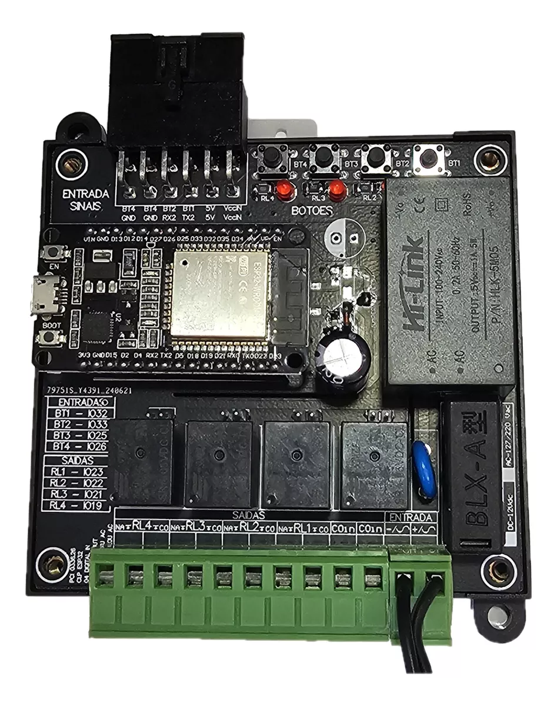
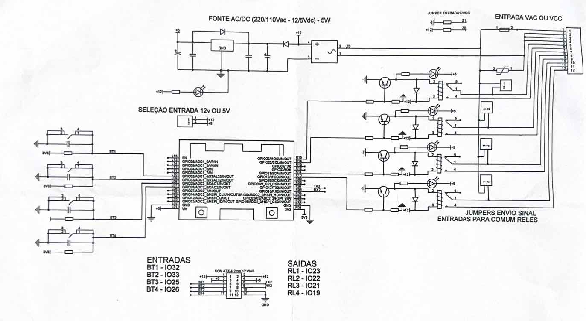

### Placa ESP32 - AUTOMAÇÃO - 4 CANAIS

A **Placa ESP32 - AUTOMAÇÃO - 4 CANAIS** é uma solução prática e eficiente para aplicações de automação residencial ou industrial. Com o módulo ESP32 integrado e suporte a múltiplas entradas e saídas, esta placa é ideal para diversos cenários que demandam conectividade e controle inteligente.

---

#### **Características Gerais**
- **Automação Residencial ou Industrial:** Compatível com uma ampla gama de aplicações, desde automação de dispositivos domésticos até controle de máquinas industriais.
- **Módulo ESP32-DevKit:** Inclui o módulo ESP32-DevKit com 30 pinos, garantindo flexibilidade e potência.
- **Saídas a Relê:** 
  - Quatro saídas independentes com capacidade para cargas de até **10A**.
  - Indicação visual do estado das saídas através de LEDs.
- **Entradas Configuráveis:**
  - Quatro entradas com botões embutidos para controle manual.
  - Conexões para integrar sensores e dispositivos externos.
- **Fonte de Alimentação Bivolt:**
  - Suporte a alimentação AC bivolt ou DC de 12V, permitindo escolha conforme a necessidade.
  - Possibilidade de enviar a alimentação de entrada para o comum dos relés via jumpers.
- **Compatibilidade com Alexa:** 
  - Configuração simples via **firmware Tasmota**, permitindo controle por voz e integração com dispositivos IoT.

---

---

#### **Especificações Técnicas**
- **Relés:**
  - 4 saídas com capacidade de até 10A.
  - Indicação por LEDs individuais.
- **Entradas:**
  - Botões embutidos e conectores para sensores.
- **Alimentação:**
  - **AC:** Bivolt (110V/220V).
  - **DC:** 12V.
- **Conectores Adicionais:**
  - Saída de **5VDC**, **12VDC** e **GND** para acessórios externos.
- **Dimensões e Proteção:**
  - Caixa plástica de proteção: **95x90x40mm**.
  - Suporte para montagem com parafusos ou trilho DIN.
  - 

---

#### **Itens Inclusos**
- Placa **ESP32 - AUTOMAÇÃO - 4 CANAIS** pronta para uso.
- **Módulo ESP32-DevKit** com 30 pinos.
- Caixa plástica de proteção com suporte e parafusos para fixação.

---

#### **Aplicações Típicas**
- Automação de iluminação residencial.
- Controle de equipamentos industriais.
- Integração com assistentes virtuais como Alexa.
- Sistemas de segurança e monitoramento remoto.
- Controle de bombas, motores e outros dispositivos elétricos.

---

#### **Destaques**
A **Placa ESP32 - AUTOMAÇÃO - 4 CANAIS** combina praticidade, robustez e conectividade, sendo uma excelente escolha para quem busca soluções modernas e confiáveis em automação.
