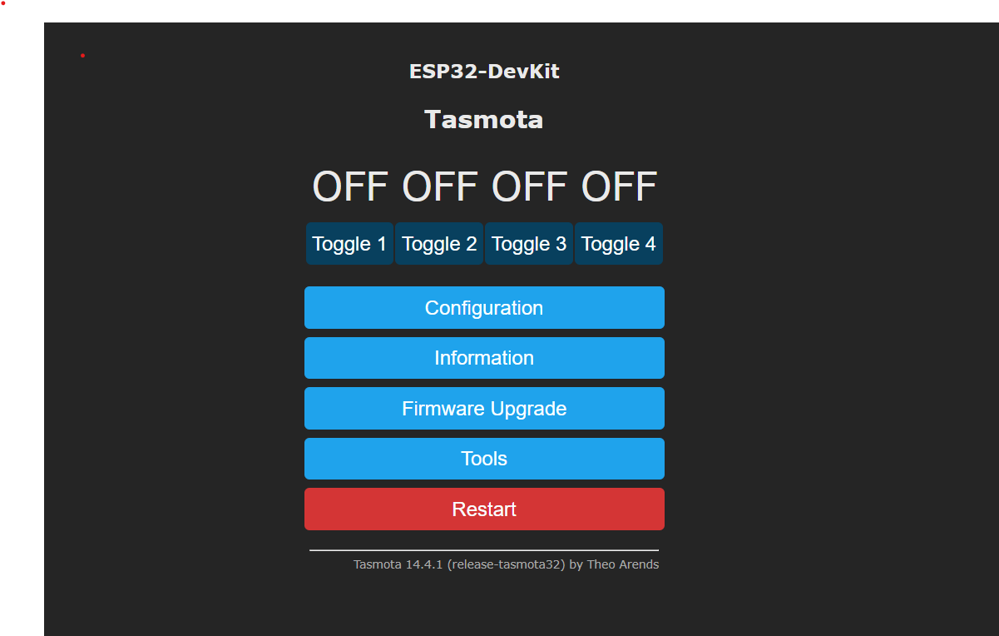
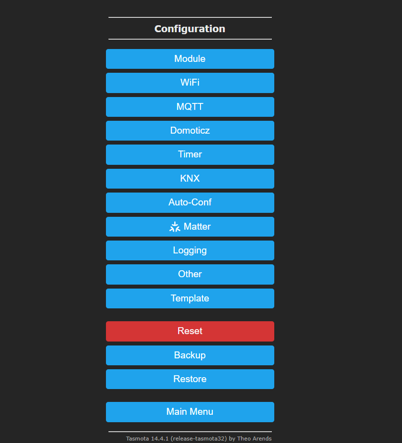

### Placa ESP32 - AUTOMAÇÃO - 4 CANAIS

A **Placa ESP32 - AUTOMAÇÃO - 4 CANAIS** é uma solução prática e eficiente para aplicações de automação residencial ou industrial. Com o módulo ESP32 integrado e suporte a múltiplas entradas e saídas, esta placa é ideal para diversos cenários que demandam conectividade e controle inteligente.

---

#### **Características Gerais**
- **Automação Residencial ou Industrial:** Compatível com uma ampla gama de aplicações, desde automação de dispositivos domésticos até controle de máquinas industriais.
- **Módulo ESP32-DevKit:** Inclui o módulo ESP32-DevKit com 30 pinos, garantindo flexibilidade e potência.
- **Saídas a Relê:** 
  - Quatro saídas independentes com capacidade para cargas de até **10A**.
  - Indicação visual do estado das saídas através de LEDs.
- **Entradas Configuráveis:**
  - Quatro entradas com botões embutidos para controle manual.
  - Conexões para integrar sensores e dispositivos externos.
- **Fonte de Alimentação Bivolt:**
  - Suporte a alimentação AC bivolt ou DC de 12V, permitindo escolha conforme a necessidade.
  - Possibilidade de enviar a alimentação de entrada para o comum dos relés via jumpers.
- **Compatibilidade com Alexa:** 
  - Configuração simples via **firmware Tasmota**, permitindo controle por voz e integração com dispositivos IoT.

---

#### **Especificações Técnicas**
- **Relés:**
  - 4 saídas com capacidade de até 10A.
  - Indicação por LEDs individuais.
- **Entradas:**
  - Botões embutidos e conectores para sensores.
- **Alimentação:**
  - **AC:** Bivolt (110V/220V).
  - **DC:** 12V.
- **Conectores Adicionais:**
  - Saída de **5VDC**, **12VDC** e **GND** para acessórios externos.
- **Dimensões e Proteção:**
  - Caixa plástica de proteção: **95x90x40mm**.
  - Suporte para montagem com parafusos ou trilho DIN.
    

---

#### **Itens Inclusos**
- Placa **ESP32 - AUTOMAÇÃO - 4 CANAIS** pronta para uso.
- **Módulo ESP32-DevKit** com 30 pinos.

---

#### **Aplicações Típicas**
- Automação de iluminação residencial.
- Controle de equipamentos industriais.
- Integração com assistentes virtuais como Alexa.
- Sistemas de segurança e monitoramento remoto.
- Controle de bombas, motores e outros dispositivos elétricos.

---

#### *** Instalação e configuração do firmware TASMOTA

	Software necessário:
        Tasmota Firmware.
        Tasmota Web Installer (recomendado para iniciantes).
        Alternativamente, utilize o esptool.py (para métodos avançados).
        Drivers USB para sua placa ESP32 (se necessário).

Passo a passo de instalação

1. Configurar o ESP32 no modo de Flash
2. Conecte o ESP32 ao computador utilizando o cabo USB.
3. Pressione e mantenha pressionado o botão de BOOT enquanto reinicia o dispositivo ou conecta-o ao computador. Isso coloca o ESP32 no modo de flash.
4. Utilizar o Tasmota Web Installer com o navegador **Chrome**
5. Acesse Tasmota Web Installer [https://tasmota.github.io/install/](https://tasmota.github.io/install/) 
6. Selecione ESP32 na lista de dispositivos.
7. Clique em Connect e escolha a porta serial correspondente ao ESP32.
8. Siga as instruções para:
	   - Detectar a placa.
      - Fazer o upload do firmware Tasmota.
      - Após o flash, o ESP32 reiniciará automaticamente.

Configurar o Wi-Fi no Tasmota (Após usar o Tasmotize. Com o **webinstaller** ele solicita ssid e senha)

    - Após o flash, o ESP32 inicia como um ponto de acesso Wi-Fi com SSID tasmota-XXXX.
    - Conecte-se a este ponto de acesso com uma senha padrão (tasmota).
    - Acesse o endereço IP padrão: 192.168.4.1 no navegador.
    - Insira as credenciais de sua rede Wi-Fi local.
---

